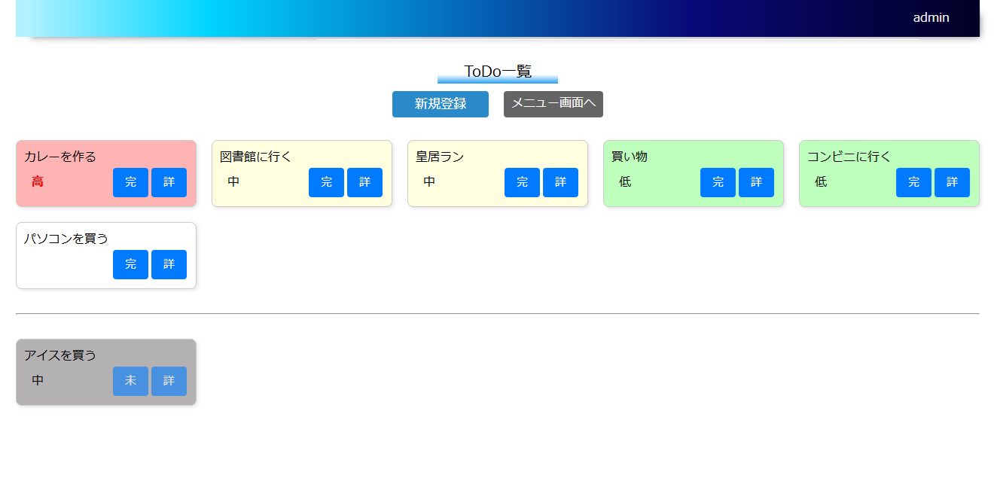

# ToDo管理システム



タスクの優先順位を視覚的に管理できる、シンプル操作のToDo管理アプリケーションです。

[本番環境（デプロイ先）はこちら](http://160.16.130.243/todo/login)
* **テスト用アカウント:**
　* **管理者アカウント**
  * **ユーザー名（ID）:** `admin`
  * **パスワード:** `adminpass`
  * **一般アカウント**
  * **ユーザー名（ID）:** `user`
  * **パスワード:** `userpass`


## 開発の背景・解決したかった課題
自身をターゲットとし、業務の中で解決したい課題をテーマとしました。
日々の業務でタスクが山積みになり、差し込みのタスクが入り、さらに入り組むことで
何から手を付けるべきかわかりづらくなる課題を解決するため、
「複数のタスク整理を自動化・視覚化する」ことを目的に開発しました。

- 長期的なタスクではなく短期的なタスク(1日単位)で管理
- 視覚的に優先順位がわかりやすい
- 優先順位が入れ替ることができる
- 終了したタスクも確認できる
  
上記の機能を盛り込み、日々の業務の課題の解決に繋げました。

また本アプリケーション作成に当たり、自身の技術力向上も目的としており
あえてAIは使用せずに開発を行いました。


## 機能一覧

### メイン機能

- **ToDo登録機能**
    - ToDoの編集・削除
- **ToDo一覧昨日**
    - ToDoの完了・未完了の移動
    - 設定した優先順位によるソート
    - ToDo詳細表示

### その他
- **ログイン・ログアウト**

- **管理ユーザーによるユーザー管理**
    - ユーザーの追加
    - ユーザーの削除

# 使用技術

## フロントエンド
- **HTML5**
- **CSS(一部埋め込みJavaScript使用)**
- **Thymeleaf 3.1.2**

## バックエンド

- **JavaSE-21**
- **Spring Framework 6.1.4、Spring Boot 3.2.3**
- **SPostgreSQL 13.18**
- **MyBatis 3.5.14**

- **SpringMockK 4.0.2**

## テスト
- **Junit5(junit-jupiter-api 5.10.0)**
- **Junit5(junit-jupiter-engine 5.10.0)**

## デプロイ環境
- **さくらのVPS**
- **centOS stream9**
- **Apache HTTP Server 2.4.62**
- **Apache tomcat 10.1.36**
- **~~Docker 28.0.0~~**(メモリの関係で頻繁にdockerが落ちるため使用中止)
  
  [技術詳細はこちらでも確認いただけます](http://160.16.130.243/todoApp/explanation-todo.html)


## 技術選定理由
静的型付けによる堅牢なAPIを構築するためJavaを選択しました。そしてSpringFrameworkを採用することでDIなどの共通処理をフレームワークに委ね、ビジネスロジックの実装に集中し、開発効率を高めています。

本アプリは画面遷移やデータ構造が比較的シンプルであり、フロントエンド側に高度で複雑な状態管理を必要としません。ファイルサイズの肥大化や初期読み込み速度の低下を避けるためSPAは採用せず、軽量に動作するサーバーサイドレンダリングを選択しました。またSpringFrameworkが持つ強固なセキュリティ機能やバリデーションの恩恵をそのまま享受し、堅牢性を担保しました。

後々の拡張性と複雑なSQLの発行、パフォーマンスチューニングを見据えて、
完全なO/RマッパーであるSpring Data JPA等ではなく、SQLを自ら記述できるMyBatisを選択しました。


#### パッケージ構成

```
┣aop			ASPECTログの設定を格納
┣config		Passwordハッシュ化やSpringSecurityの設定クラスを格納
┣controller	コントローラークラスを格納
┣entity		エンティティクラスを格納
┣exception		業務例外の際に発生させる独自例外を格納
┣form			ユーザー入力フォームを格納
┣helper		変換を行うクラスを格納
┣repository	DBアクセス時に使用するリポジトリーを格納
┣service		サービスクラスを格納
┣utility		テスト時の大量データ作成やバージョン情報の出力などの補助ツールを格納

```
